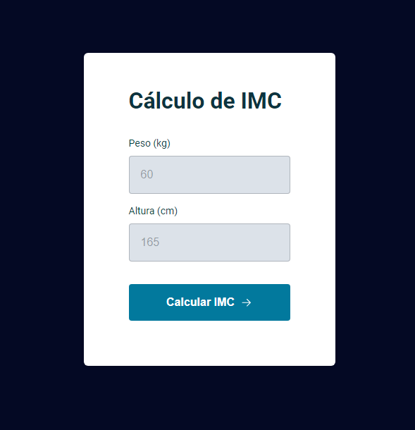

<h1 align="center"> Cálculo de IMC</h1>

Desafio do Stage 05, onde criamos uma calculadora de IMC.

  <a href="#tecnologias">Tecnologias</a>&nbsp;&nbsp;&nbsp;|&nbsp;&nbsp;&nbsp;
  <a href="#projeto">Projeto</a>&nbsp;&nbsp;&nbsp;|&nbsp;&nbsp;&nbsp;
  <a href="#Temas-Abordados">Temas abordados</a>&nbsp;&nbsp;&nbsp;|&nbsp;&nbsp;&nbsp;
  <a href="#funcionalidades">Funcionalidades</a>&nbsp;&nbsp;&nbsp;|&nbsp;&nbsp;&nbsp;

 

## Tecnologias:

- HTML
- CSS
- Media Queries
- JavaScript

## Projeto:

Uma calculadora de IMC.

 

## Temas abordados:

- Estrutura e validação de dados
- Animações com CSS
- Funções no Javascript
- ES6 Modules
- Refatoração

## Funcionalidades:

- Aplicando a funcionalidade "Escape"
- Evento input